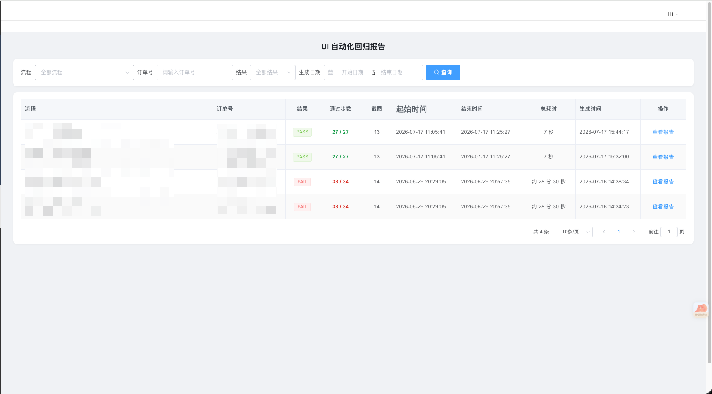
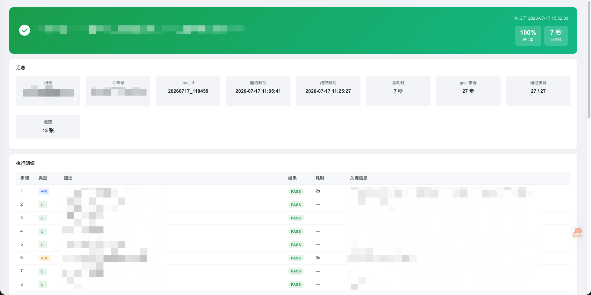
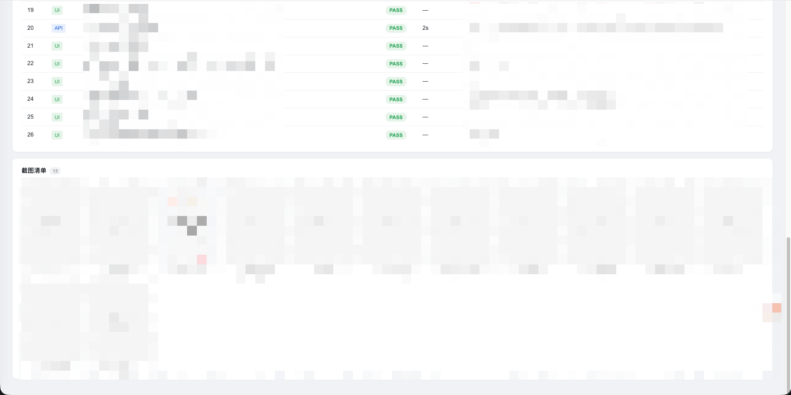

# Automobile — 移动端 UI 自动化回归测试 Skill

一个基于 [Claude Code](https://claude.com/claude-code) Skill 机制的移动端 UI 自动化回归测试框架。用「Claude 编排 + API 调用 + 视觉驱动 UI」三段式跑通端到端业务流程，底层 UI 操作由 [droidrun/mobilerun](https://github.com/droidrun/mobilerun)（MIT）驱动。

> 声明式扩展：新增一条回归流程只需增加一个「叶子」目录（用例 + App 操作手册 + API 子 skill），无需改动核心引擎。

## 效果展示

> 以下为自建后台对报告的展示效果（后台需自行实现，见 [`docs/backend-integration.md`](docs/backend-integration.md)）。图中业务信息已脱敏。

**报告列表**：按流程 / 订单号 / 结果 / 日期筛选，一览每次回归的结果、通过步数与耗时。



**报告详情**：顶部通过率与汇总卡片，执行明细逐步列出步骤类型（API / UI / ADB）、结果、耗时与关键信息，底部附截图清单。





## 特性

- **三段式链路**：`[API]` 步骤直连接口、`[UI]` 步骤交给视觉模型驱动、`[ADB]` 步骤由编排层直接注入，按用例中的标记自动分段执行。
- **双 Agent 协作**：Manager（决策）+ Executor（视觉定位）协作完成复杂 UI 操作。
- **路由 + 叶子架构**：`core/` 是所有流程共用的执行内核，各条业务流程作为 `businessLine/` 下的叶子独立维护。
- **自动报告**：产出单文件 HTML 报告与结构化 JSON，按订单号归档截图。
- **模型无关**：决策/视觉角色的 provider、模型、端点均可通过 `.env` 配置，支持 Anthropic 官方端点或任意兼容网关。

## 环境要求

- Python 3.10+
- [ADB](https://developer.android.com/tools/adb)（Android Debug Bridge）
- 一台开启无线调试的 Android 11+ 测试设备（Android 10 及以下走 USB tcpip，见 `setup.md`）
- 一个可用的 LLM 服务凭证（Anthropic 官方，或任意兼容网关）

## 快速开始

```bash
# 1. 安装依赖
cd .claude/skills/automobile
python3 -m venv .venv && source .venv/bin/activate
pip install -r requirements.txt

# 2. 配置环境变量
cp .env.example .env
# 编辑 .env，填入你的 API Key、模型端点、测试设备信息

# 3. 连接设备（详见 setup.md）
adb connect <设备IP>:<端口>
mobilerun doctor      # 确认 Portal / 无障碍 / Content Provider 就绪

# 4. 在 Claude Code 中运行
#    /automobile 跑一下 <你的流程诉求>
```

环境准备的完整步骤（ADB 配对、MobileRun Portal 安装、无障碍授权）见 [`setup.md`](.claude/skills/automobile/setup.md)。

## 目录结构

```
.claude/skills/automobile/
├── SKILL.md                 # 路由层：识别诉求 → 定位叶子 → 调用其 playbook
├── setup.md  requirements.txt  .env.example
├── core/                    # 共享执行内核（所有流程共用，新增流程不改）
│   ├── common_playbook.md   # 通用执行约定（预检 / 步骤规则 / 报告）
│   ├── runner.py            # UI 执行引擎（MobileRun 双 Agent）
│   ├── router.py            # 路由：加载 routes.yaml，匹配/解析叶子
│   ├── config/              # config.yaml（模型/设备）+ routes.yaml（流程注册表）
│   ├── models.py            # 报告数据模型
│   └── tools/               # 截图 / 报告生成 / doctor 预检
├── sub_skills/              # 可选公共能力：见下方「可选公共能力」一节
│   ├── appcard_gen/         # 喂截图自动生成 App 操作手册
│   ├── pic_upload/          # 截图上传到你的图床，拿回可访问 URL
│   └── report_upload/       # 报告原文上传到你的接口落库留底
└── businessLine/            # 业务树：业务线 → App → 品类 → 场景（叶子=一条流程）
    └── <example>/…          # 每个叶子自带 SKILL.md / cases / app_cards / skills
```

## 可选公共能力（sub_skills）

`sub_skills/` 下是三个**独立、可选**的辅助能力，被主流程按需调用，也可单独使用。它们都不是回归流程本身，不进 `businessLine/` 业务树、不登记 `routes.yaml`。默认不配置就完全不启用，不影响跑通最小流程。

| 子 skill | 是什么 | 什么时候用 | 效果 |
|----------|--------|-----------|------|
| **appcard_gen** | App 操作手册生成器 | 接入一个新 App、要写 `app_cards/<app>.md` 又不想手敲时 | 喂一组页面截图，多模态识别每页的可点/可断言控件，套骨架自动生成一份控件手册，人工核对即可用 |
| **pic_upload** | 图片上传器（纯标准库） | 想把报告里的截图存到自己的图床/对象存储、让报告能在线看图时 | 把本地截图（单张或整目录）POST 到你配置的接口，返回可访问 URL，回填进报告的 `cdn_url` |
| **report_upload** | 报告落库器（纯标准库） | 想把每次回归的 `report.json` 原文留底到自己的后台时 | 把报告原文按订单号 POST 到你配置的接口落库，供你自己的后台系统接收、存储与展示 |

> 三者的接口地址、鉴权全部由环境变量提供，脚本内**无任何预置地址**：`pic_upload` 需 `PIC_UPLOAD_URL`(+`PIC_UPLOAD_SIGN`)、`report_upload` 需 `REPORT_UPLOAD_URL`，未配置即安全跳过。报告的「上传截图 / 落库留底」由 `core/tools/publish_report.py` 在配了对应变量时自动串起这两个能力；详见各子 skill 的 `SKILL.md` 与 `core/common_playbook.md` 报告发布章节。
>
> 说明：本框架只负责**产出报告并可选地上传**，接收上传、存储、在网页展示的**后台系统需你自行实现**（上表的接口即对接点）。想自建后台的话，[`docs/backend-integration.md`](docs/backend-integration.md) 提供了一套可直接参考的库表设计与 `report.json` 落库映射思路。

## 如何新增一条回归流程

1. 在 `businessLine/` 下建叶子目录 `<业务线>/<App>/<品类>/<场景>/`（复制现有叶子改内容最省事）。
2. 填该叶子的四类声明式文件（都不写 Python）：
   - `SKILL.md`：这条流程的 playbook，只写因流程而异的内容，通用约定引用 `core/common_playbook.md`。
   - `cases/cases.yaml`：goal 步骤，用 `[API]` / `[UI]` / `[ADB]` 标记分段。
   - `app_cards/<app>.md`：该 App 的页面/控件操作手册。
   - `skills/`：这条流程用到的 API 子 skill。
3. 在 `core/config/routes.yaml` 登记一条 route（skill_name / 四维语义 / leaf_dir / keywords）。

Router 自动加载，无需改 `router.py` 与路由层。

## 致谢

- 底层 UI 驱动基于 [droidrun/mobilerun](https://github.com/droidrun/mobilerun)（MIT License）。

## License

本项目采用 [MIT License](LICENSE)。

